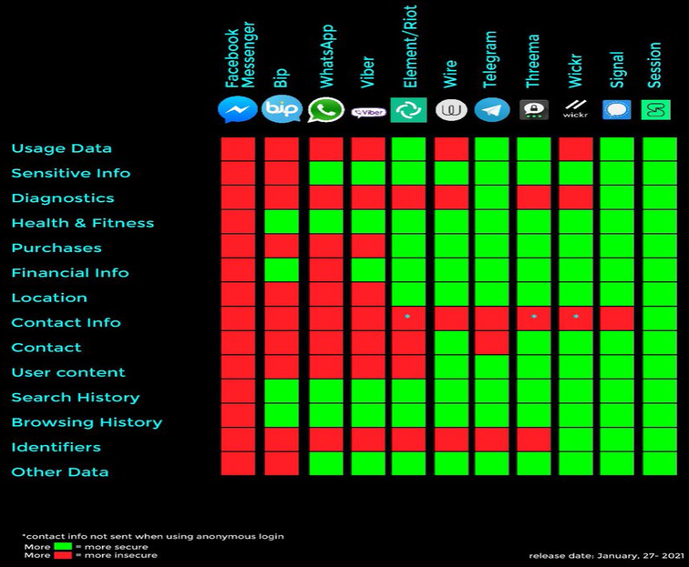

<!DOCTYPE html>
<html lang='en'>

<head>

  <meta charset='UTF-8'>

<body>

<h1>📱🦊🔒 Android Mobile 🔒🦊📱</h1>

<blockquote><h3>"No matter who you are, every day of your life, you're sitting in a database just ready to be looked at." (Edward Snowden)</h3></blockquote>

<!-- ################################################# -->

<h3>HARDENING REFERENCES</h3>

<table style="width: 100%" cellspacing="0" cellpadding="0">
  <tr>
   <td align="left" valign="top" style="width: 50%">
   <a href="https://guardianproject.info" target="_blank">• Guardian Project</a> 
   <a href="https://github.com/guardianproject" target="_blank">• Guardian Project - GitHub</a> 
   <a href="https://www.whonix.org/wiki/Other_Operating_Systems" target="_blank">• Whonix - Anonymize Other Operating Systems</a> 
   <a href="https://www.whonix.org/wiki/Tips_on_Remaining_Anonymous#Avoid_(Mobile)_Phone_Verification_(Use_only_with_caution)" target="_blank">• Whonix - Avoid (Mobile) Phone Verification (Use only with caution)</a> 
   <a href="https://source.android.com/docs/core/architecture/kernel/hardening" target="_blank">• Android - Kernel Hardening</a> 
   <a href="https://www.cisecurity.org/benchmark/google_android" target="_blank">• Google - Android CIS Benchmark</a> 
   <a href="https://mas.owasp.org" target="_blank">• OWASP - Mobile Application Security</a> 
   <a href="https://attack.mitre.org/techniques/mobile/" target="_blank">• MITRE ATT&CK - Mobile Techniques</a> 
    </td>    
    <td align="left" valign="top" style="width: 50%">
    <a href="https://public.cyber.mil/stigs/downloads/?_dl_facet_stigs=mobility" target="_blank" rel="noopener noreferrer">• DoD Cyber Exchange - Security Technical Implementation Guides (STIGs)</a> 
    <a href="https://blog.torproject.org/mission-improbable-hardening-android-security-and-privacy" target="_blank">• Mission Improbable: Hardening Android for Security And Privacy</a> 
    <a href="https://en.wikipedia.org/wiki/EncroChat" target="_blank">• EncroChat - Wikipedia</a> 
    <a href="https://theintercept.com/2021/07/27/pegasus-nso-spyware-security" target="_blank">• HOW TO DEFEND YOURSELF AGAINST THE POWERFUL NEW NSO SPYWARE ATTACKS DISCOVERED AROUND THE WORLD</a> 
    <a href="https://citizenlab.ca/2023/04/nso-groups-pegasus-spyware-returns-in-2022" target="_blank">• NSO Group’s Pegasus Spyware Returns in 2022 with a Trio of iOS 15 and iOS 16 Zero-Click Exploit Chains</a> 
     
    </td>    
  </tr>
</table>

<!-- ################################## -->
 

<h3>ANDROID CUSTOM ROM</h3>

<strong><a href="https://grapheneos.org">GraphenoOS</a></strong> <a href="https://grapheneos.org/faq#supported-devices">(Supported Devices)</a> - Security and privacy focused mobile OS 
<strong><a href="https://calyxos.org">CalyxOS</a></strong> <a href="https://calyxos.org/">(Supported Devices)</a> - Private by Design 
<strong><a href="https://divestos.org/">DivestOS</a></strong> <a href="https://divestos.org/pages/devices">(Supported Devices)</a> - A mobile operating system divested from the norm 
<strong><a href="https://wiki.lineageos.org/">LineageOS</a></strong> <a href="https://projectelixiros.com/download">(Supported Devices)</a> - A free and open-source operating system for various devices 
<strong><a href="https://projectelixiros.com">Project Elixir</a></strong> <a href="https://www.kali.org/get-kali/#kali-mobile">(Supported Devices)</a> - Unleash Innovation 
<strong><a href="https://mobian-project.org/">Mobian</a></strong> <a href="https://wiki.debian.org/Mobian/Devices">(Supported Devices)</a> - A Debian derivative for mobile devices 
<strong><a href="https://ubuntu-touch.io/">Ubuntu-Touch</a></strong> <a href="https://ubports.com/nl/supported-products">(Supported Devices)</a> - We are building privacy and freedom focussed mobile software 
<strong><a href="https://www.replicant.us/">Replicant</a></strong> <a href="https://redmine.replicant.us/projects/replicant/wiki/DeviceStatus">(Supported Devices)</a> - A fully free Android distribution running on several devices 
<strong><a href="https://postmarketos.org/">postmarketOS</a></strong> <a href="https://wiki.postmarketos.org/wiki/Devices">(Supported Devices)</a> - A real Linux distribution for phones 
<strong><a href="https://www.kali.org/get-kali/#kali-mobile">Kali Mobile</a></strong> <a href="https://www.kali.org/get-kali/#kali-mobile">(Supported Devices)</a> - Kali NetHunter is a free &amp; Open-source Mobile Penetration Testing Platform 
<strong><a href="https://github.com/climberhunt/PiPhone">PiPhone</a></strong> - A DIY cellphone based on Raspberry Pi 

<h4>Others custom roms:</h4>

Crdroid - https://crdroid.net/ 
Paranoid Android - https://paranoidandroid.co/ 
ResurrectionRemix - https://github.com/ResurrectionRemix 
OmniROM - https://omnirom.org/ 
Evolution-x - https://evolution-x.org/ 
Droidontime- https://www.droidontime.com/ 
Projectsakura - https://sourceforge.net/projects/projectsakura/ 
Corvus-os - https://sourceforge.net/projects/corvus-os/ 
Havoc-os - https://sourceforge.net/projects/havoc-os/ 
Revengeos - https://sourceforge.net/projects/revengeos/ 
Superioros - https://sourceforge.net/projects/superioros/ 
AospExtended - https://github.com/AospExtended 
Arrowos - https://www.arrowos.net/ 
Blissroms - https://blissroms.com/ 
Derpfest - https://derpfest.org/ 
Syberiaos - https://syberiaos.com/ 
Dirtyunicorns - https://dirtyunicorns.com/ 
Aosip - http://aosip.weebly.com/ 
Xiaomifirmwareupdater - https://xiaomifirmwareupdater.com/miui/ 

*Best choice for intermediate security (2023): GrapheneOS (Google Pixel) that uses hardened malloc, sandboxed play services and communicate via Matrix Protocol
 

<!-- ################################## -->
 

<h3>CELLEBRITE UFED</h3>

<h4>Defeating some of the Cellebrite UFED exploits</h4>

https://github.com/levlesec/lockup 
https://github.com/nekohasekai/lockup 

<!-- ################################## -->
 

<h3>PHONE TRACKING</h3>

<em>GSM network etc are highly traceable, even a turned off cell phone is not safer.</em>

"The effective use of burner phones to hide from government surveillance requires, at a minimum: not reusing either SIM cards or devices; not carrying different devices together; not creating a physical association between the places where different devices are used; and not calling or being called by the same people when using different devices. (This isn't necessarily a complete list; for example, we haven't considered the risk of physical surveillance of the place where the phone was sold, or the places where it's used, or the possibility of software to recognize a particular person's voice as an automated method for determining who is speaking through a particular phone."

<!-- ################################## -->
 

<h3>CRYPTOPHONES</h3>

• Encrochat case 
The dark phones (Encrochat) — Criminals are building their own communication system 
https://xperylab.medium.com/the-dark-phones-encrochat-criminals-are-building-their-own-communication-system-474f3aeef759 

<!-- ################################## -->
 

<h3>BURNER PHONES</h3>

•    <a href="https://www.whonix.org/wiki/Other_Operating_Systems" target="_blank">• Whonix - Anonymize Other Operating Systems</a> 
• https://www.wired.com/story/how-to-use-burner-phone 

<!-- ################################## -->
 

<h3>BACKDOORS EVERYWHERE</h3>

 

<!-- ################################## -->
 

<h3>ANDROID ROOT</h3>

• XDA Forums - https://xdaforums.com 
• Magisk - https://github.com/topjohnwu/Magisk 
• TWRP - https://twrp.me 
• Android Debloater - https://github.com/0x192/universal-android-debloater 
• RootzWiki Forums - https://rootzwiki.com/index 
• Android Central - https://forums.androidcentral.com/ 
• Android Forums - https://androidforums.com/ 
• PHONEDB - https://phonedb.net/index.php?m=repository&list=rom_update 
• TheUnlockr - https://theunlockr.com/roms/android-roms/ 
• SamMobile - https://sammobile.com/ 
• r/androidroot - https://www.reddit.com/r/androidroot 

<!-- ################################## -->
 

<h3>MOBILE STORE</h3>

• F-droid - https://f-droid.org 
• IzzyOnDroid - https://apt.izzysoft.de/fdroid 
• DivestOS - https://divestos.org 
• Aurora Store - https://auroraoss.com 

Note: https://www.privacyguides.org/en/android/#f-droid

<!-- ################################## -->
 

<h3>MOBILE SECURITY APPS</h3>

<em>For intermediate security, it's no military-grade security.</em>

<h4>Sandboxes</h4>
• Shelter - https://gitea.angry.im/PeterCxy/Shelter#shelter 
• Insular - https://secure-system.gitlab.io/Insular 

<h4>Emergency</h4>
• Wasted - https://f-droid.org/en/packages/me.lucky.wasted 
• Ripple - https://github.com/guardianproject/ripple 
• Find My Device (FMD) - https://f-droid.org/en/packages/de.nulide.findmydevice 

<h4>Sanitizers</h4>
• Extirpater - https://f-droid.org/en/packages/us.spotco.extirpater 
• RandomFileMaker - https://f-droid.org/en/packages/io.github.randomfilemaker 
• WipeFiles - https://github.com/peterhearty/WipeFiles 

<h4>Track trackers</h4> 
• Exodus - https://github.com/Exodus-Privacy/exodus-android-app 
• Rethink-app - https://github.com/celzero/rethink-app 

<h4>Passwords</h4>
• KeePassDX - https://github.com/Kunzisoft/KeePassDX 
• Aegis - https://github.com/beemdevelopment/Aegis 
• Authenticator Pro - https://github.com/jamie-mh/AuthenticatorPro 
• Yubico - https://github.com/Yubico/yubioath-flutter 

<h4>Cryptograhy</h4>
• Cryptomator - https://f-droid.org/en/packages/org.cryptomator.lite 
• EDS Lite - https://f-droid.org/packages/com.sovworks.edslite 
• Hash Checker - https://github.com/hash-checker/hash-checker 
• Hash Easily - https://github.com/seoulcodingcafe/HashEasily 

<h4>Anon web</h4>
• InviZible - https://github.com/Gedsh/InviZible 
• Orbot - https://github.com/guardianproject/orbot 

<h4>Keyboards</h4>
• Florisboard (Beta) - https://github.com/florisboard/florisboard 
• AnySoftKeyboard - https://anysoftkeyboard.github.io 
• HackersKeyboard - https://github.com/klausw/hackerskeyboard 

<h4>Others</h4>
• EtchDroid - https://github.com/EtchDroid/EtchDroid 
• Android Faker - https://github.com/Android1500/AndroidFaker 
• Free implementation of Play Services - https://github.com/microg/GmsCore 
• Phones - https://www.gsmarena.com 

<!-- ################################## -->
 

<h3>MOBILE SECURITY</h3>

<h4>Password</h4>
• It's obvious that you don't use a password pattern

<h4>Two Phones</h4>
• The phone with bank applications is in the safe
• Adjusting limits is also important

<!-- ################################## -->
 

<h3>COMMUNICATION</h3>

• Chat Secure 
https://chatsecure.org 

• XMPP vs Matrix vs MQTT 
https://www.rst.software/blog/xmpp-vs-matrix-vs-mqtt-which-instant-messaging-protocol-is-best-for-your-chat-application 

<h4>Chats</h4>

<h5>• XMPP</h5>
• https://github.com/profanity-im/profanity 
• https://github.com/zom/zom-android 
• http://conversations.im 
• https://github.com/psi-im/psi 
• https://github.com/dino/dino 
• https://github.com/nioc/xmpp-web 

<h5>• Jami</h5>
https://jami.net 

<h5>• Threema</h5>
https://threema.ch/en 

<h5>• Matrix Protocol</h5>
• https://matrix.org 
• https://github.com/matrix-org 
• https://en.wikipedia.org/wiki/Matrix_(protocol) 
• https://www.reddit.com/r/Mastodon/comments/mzubbb/mastodon_vs_matrix 

<h5>• Session</h5>
• https://github.com/oxen-io/session-desktop 
• https://github.com/oxen-io/session-android 
• https://arxiv.org/pdf/2002.04609.pdf
• https://github.com/GNU-Linux-libre/Awesome-Session-Group-List 

<h5>• Signal</h5>
• https://signal.org/android/apk/ 
• https://github.com/signalapp 
• https://community.signalusers.org/t/overview-of-third-party-security-audits/13243 
• Signal Did NOT Get Hacked - https://www.youtube.com/watch?v=QEq2JQ6nzuQ 

<h5>• Briar</h5>
https://code.briarproject.org/briar/briar 

<h4>Phone Numbers</h4>

<h5>• Phone numbers</h5>
• MySudo - https://mysudo.com 
• SilentLink - Instant eSIM - https://silent.link 
• Textverified - https://www.textverified.com 

<h4>SMS Verify</h4>
http://hs3x.com 
http://smsget.net 
https://sms-online.co 
https://catchsms.com 
http://sms-receive.net 
http://sms.sellaite.com 
http://receivefreesms.net 
https://receive-a-sms.com 
http://receivesmsonline.in 
http://receivefreesms.com 
http://receivesmsonline.me 
https://smsreceivefree.com 
https://smsreceiveonline.com 
https://receive-sms-online.com 
https://www.receivesmsonline.net 
https://www.temp-mails.com/number 
https://www.freeonlinephone.org 
https://getfreesmsnumber.com 

<!-- ################################## -->
 

<h3>OTHERS APPS</h3>

<h4>Simple Apps</h4

• Simple Dialer - A handy phone call manager with phonebook, number blocking and multi-SIM support.
• Simple Contacts - A premium app for contact management with no ads, supports groups and favorites.
• Simple Calculator - A calculator for your quick calculations.
• Simple Calendar - Be notified of the important moments in your life.
• Simple Clock - A combination of a clock, alarm, stopwatch and timer.

<h4>File Manager</h4>

• Amaze File Manager - 
• Material Files - 
• Ghost Commander - 

<h4>Browsers</h4>

• Bromite - https://www.bromite.org
• Ungoogled Chromium Android -https://uc.droidware.info
• Firefox - https://play.google.com/store/apps/details?id=org.mozilla.firefox&hl=en_US&gl=US

<h4>Personalisation</h4>

• Neo-Launcher - https://github.com/NeoApplications/Neo-Launcher

• Lawnchair 2 - https://lawnchair.app
Continuation of Lawnchair 1; Pixel features; fork of Launcher3.

• Lawndesk - https://github.com/renzhn/Lawndesk
Fork of Lawnchair V2; app-drawer-free launcher.

• Librechair - Degoogled; fork of Lawnchair V2 & Launcher3.

• LawnChair 12 - https://github.com/LawnchairLauncher/lawnchair/releases
Contininuation of LawnChair V2 with support for QuickSwitch and more. Includes a nice simple design that mimics the design of Google's Pixel launcher. Also includes in app Monet'like theming with themed icons(optional with a separate package called LawnIcons) and wallpaper based theming.

<h4>E-mail</h4>

• K-9 Mail - https://k9mail.app

<h4>Navigation</h4>

• StreetComplete - https://f-droid.org/en/packages/de.westnordost.streetcomplete/
• OsmAnd - https://osmand.net/

<h4>Cameras</h4>

• Open Camera - https://opencamera.sourceforge.io
• Simple Camera - https://f-droid.org/en/packages/com.simplemobiletools.camera

<h4>Streaming</h4>

• NewPipe - Lightweight Google-free YouTube client.
• LibreTube - An alternative YouTube front end, for Android.

<h4>Media Players</h4>

• mpv - https://mpv.io/ 
• VLC - https://www.videolan.org/

<h4>Office</h4>

• Collabora Office - https://www.collaboraoffice.com/release-news/collabora-office-android-beta/ 
• CryptPad - Alternative to Google Docs 

<h4>Advertisement blocking</h4>
• AdAway - Ad blocker for Android using the hosts file (Root permission is optional but it is recommended).
• Blokada - Ad blocker for Android using the VPN API.
• DNSfilter - Ad blocker for Android using a VPN, supports hosts files.
• DNS66 - DNS66 blocks advertisements on Android by intercepting DNS requests using Android's VPN layer and blocking requests for blacklisted hosts.
• NetGuard - NetGuard provides simple and advanced ways to block access to the internet - no root required.
• RethinkDNS + Firewall - DNS over HTTPS / DNS over Tor / DNSCrypt client, firewall, and connection tracker for Android.

<!-- ################################## -->
 

<h3>SOCIAL NETWORKING</h3>

<h4>Mastodon</h4> 
• https://joinmastodon.org 
• https://github.com/mastodon/mastodon 
• https://en.wikipedia.org/wiki/Mastodon_(social_network) 

• Nitter - Alternative to Twitter 

• Diaspora - Alternative to Facebook 

<!-- ################################## -->
 

<h3>OTHERS</h3>
• https://forum.f-droid.org 
• https://xdaforums.com/c/general-discussion.240/ 
• https://xdaforums.com/search/?q= 
• https://www.reddit.com/r/privacy 
• https://www.reddit.com/r/PrivacyGuides 
• https://fossphones.com/os.html 
• https://support.apple.com/en-us/HT212650 
• 2FA - https://2fa.directory 

 

<!--################################### -->

 <a href="https://github.com/RENANZG/My-Android-Mobile?tab=readme-ov-file#">Back to Top ⬆</a> 

<!--################################### -->

 
 
 

Made with ♥

<!--################################### -->

</body>
</html>

